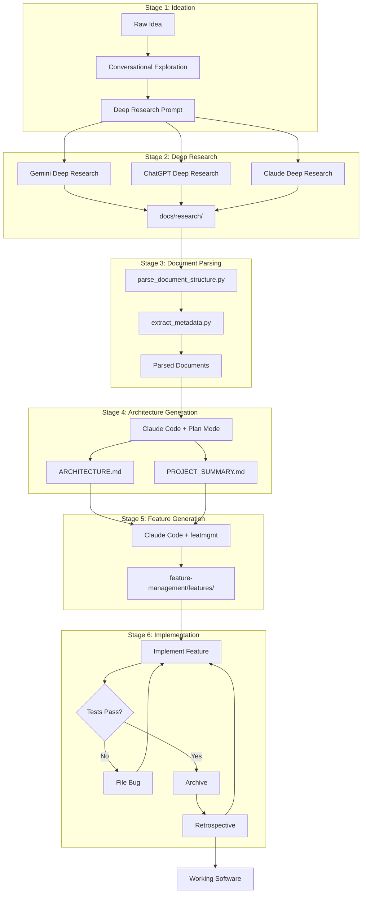
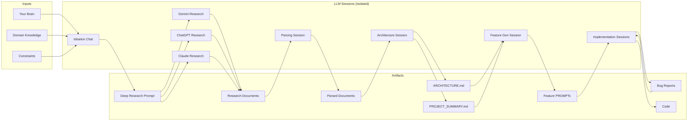
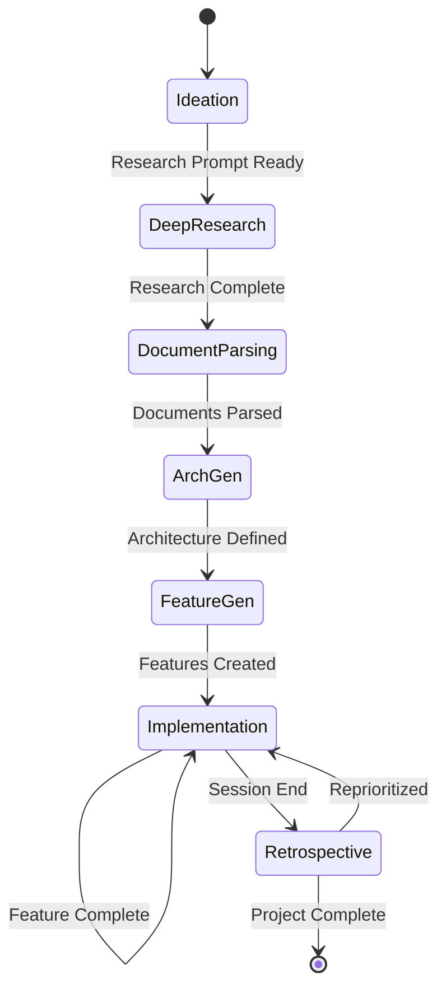

# Context Engineering: A Spec-Driven Development Methodology

## Executive Summary

Context Engineering is a structured methodology for software development with Large Language Models (LLMs). Rather than treating LLMs as conversational tools for ad-hoc assistance, this approach treats them as stateless compute units that transform well-structured context into artifacts. Each session receives curated inputs and produces defined outputs that feed subsequent stages.

The core insight: **Documents are the interface between sessions.**

---

## Core Philosophy

### 1. Session Isolation with Curated Context

Each LLM session is treated as a pure function:
- **Inputs**: Specific documents, parsed research, architectural specs
- **Outputs**: New artifacts (architecture docs, features, implementations)
- **No reliance on**: Memory, prior sessions, or accumulated context

This prevents context degradation over long conversations and ensures reproducibility.

### 2. Documents as the API

Artifacts produced at each stage become the "API contract" for the next:

```
┌─────────────────────────────────────────────────────────────────────┐
│                     DOCUMENTS AS INTERFACES                         │
├─────────────────────────────────────────────────────────────────────┤
│                                                                     │
│   Session A                    Session B                            │
│  ┌─────────┐                  ┌─────────┐                          │
│  │         │   writes to      │         │                          │
│  │  LLM    │ ───────────────► │  .md    │                          │
│  │         │                  │  files  │                          │
│  └─────────┘                  └────┬────┘                          │
│                                    │                                │
│                                    │ reads from                     │
│                                    ▼                                │
│                               ┌─────────┐                          │
│                               │         │                          │
│                               │  LLM    │ ──► Next artifact        │
│                               │         │                          │
│                               └─────────┘                          │
│                                                                     │
└─────────────────────────────────────────────────────────────────────┘
```

### 3. Progressive Refinement

Context is progressively structured and compressed:

```
Raw Ideas  →  Research  →  Parsed Chunks  →  Architecture  →  Features  →  Code
 (broad)      (deep)       (navigable)       (structured)     (atomic)    (concrete)
```

Each stage reduces entropy and increases actionability.

---

## The Pipeline

### Stage Overview

```
┌──────────────────────────────────────────────────────────────────────────────┐
│                        CONTEXT ENGINEERING PIPELINE                          │
└──────────────────────────────────────────────────────────────────────────────┘

  ┌─────────┐    ┌─────────┐    ┌─────────┐    ┌─────────┐    ┌─────────┐
  │         │    │  DEEP   │    │ DOCUMENT│    │  ARCH   │    │ FEATURE │
  │ IDEATION│───►│ RESEARCH│───►│ PARSING │───►│  GEN    │───►│  GEN    │───┐
  │         │    │         │    │         │    │         │    │         │   │
  └─────────┘    └─────────┘    └─────────┘    └─────────┘    └─────────┘   │
                                                                            │
       ┌────────────────────────────────────────────────────────────────────┘
       │
       ▼
  ┌─────────┐    ┌─────────┐    ┌─────────┐
  │ FEATURE │    │   BUG   │    │ RETRO-  │
  │  IMPL   │◄──►│ FILING  │◄──►│ SPECTIVE│
  │         │    │         │    │         │
  └─────────┘    └─────────┘    └─────────┘
       │
       └──────────────► WORKING SOFTWARE
```

---

## Stage 1: Ideation

**Purpose**: Transform a vague idea into a comprehensive context that captures the full scope of what you want to build.

**Process**:
1. Open a fresh LLM chat session
2. Engage conversationally to explore the idea
3. Iterate until the LLM understands the big picture
4. Request generation of a deep research prompt

**Inputs**: Your initial idea, domain knowledge, constraints

**Outputs**: A structured deep research prompt

```
┌─────────────────────────────────────────────────────────────────┐
│                      IDEATION SESSION                           │
├─────────────────────────────────────────────────────────────────┤
│                                                                 │
│    You ◄────────────────────────────────► LLM                   │
│         "I want to build..."                                    │
│         "What about edge cases for..."                          │
│         "The users would be..."                                 │
│         "Constraints include..."                                │
│                                                                 │
│    After N iterations:                                          │
│    ┌─────────────────────────────────────────────────────────┐  │
│    │              DEEP RESEARCH PROMPT                       │  │
│    │  • Core problem statement                               │  │
│    │  • Technical domains to explore                         │  │
│    │  • Specific questions to answer                         │  │
│    │  • Constraints and requirements                         │  │
│    └─────────────────────────────────────────────────────────┘  │
│                                                                 │
└─────────────────────────────────────────────────────────────────┘
```

**Best Practices**:
- Don't rush; thoroughness here pays dividends later
- Challenge the LLM's assumptions
- Explicitly state non-obvious constraints
- Ask the LLM to identify gaps in your description

---

## Stage 2: Deep Research

**Purpose**: Gather comprehensive, multi-perspective research on the problem domain.

**Process**:
1. Take the deep research prompt to multiple LLMs
2. Run deep research on: **Gemini**, **ChatGPT**, **Claude**
3. Save all results to `docs/research/`

**Inputs**: Deep research prompt from Stage 1

**Outputs**: Multiple research documents in `docs/research/`

```
                    ┌─────────────────────┐
                    │  DEEP RESEARCH      │
                    │  PROMPT             │
                    └──────────┬──────────┘
                               │
           ┌───────────────────┼───────────────────┐
           │                   │                   │
           ▼                   ▼                   ▼
    ┌─────────────┐     ┌─────────────┐     ┌─────────────┐
    │   GEMINI    │     │  CHATGPT    │     │   CLAUDE    │
    │   Deep      │     │  Deep       │     │   Deep      │
    │   Research  │     │  Research   │     │   Research  │
    └──────┬──────┘     └──────┬──────┘     └──────┬──────┘
           │                   │                   │
           ▼                   ▼                   ▼
    ┌─────────────┐     ┌─────────────┐     ┌─────────────┐
    │ gemini_     │     │ chatgpt_    │     │ claude_     │
    │ research.md │     │ research.md │     │ research.md │
    └─────────────┘     └─────────────┘     └─────────────┘
           │                   │                   │
           └───────────────────┼───────────────────┘
                               │
                               ▼
                    ┌─────────────────────┐
                    │   docs/research/    │
                    └─────────────────────┘
```

**Rationale for Multiple LLMs**:
- Different training data surfaces different insights
- Reduces blind spots from any single model
- Cross-validation of technical approaches
- Diverse perspective on tradeoffs

---

## Stage 3: Document Parsing

**Purpose**: Transform large research documents into navigable, tokenefficient chunks that fit LLM context windows effectively.

**Process**:
1. Use the `document-parser` skill (or subagents) for each research document
2. Extract structure, generate abstracts, extract metadata
3. Produce parsed outputs for each research document
4. Create `SYNTHESIS.md` - unified cross-source analysis

**Inputs**: Raw research documents from `docs/research/`

**Outputs**:
- Structured, navigable document representations (per source)
- `SYNTHESIS.md` - unified analysis across all sources (key deliverable)

```
┌─────────────────────────────────────────────────────────────────────────┐
│                        DOCUMENT PARSING                                 │
├─────────────────────────────────────────────────────────────────────────┤
│                                                                         │
│   Raw Document                        Parsed Output                     │
│   (25,000+ tokens)                    (Navigable)                       │
│                                                                         │
│   ┌─────────────────┐                 ┌─────────────────────────────┐   │
│   │ # Header 1      │                 │ SECTION MAP                 │   │
│   │ Long content... │                 │ ├─ Header 1 (850 tokens)    │   │
│   │ ## Header 1.1   │    ────────►    │ │  └─ Header 1.1 (420 tok)  │   │
│   │ More content... │                 │ └─ Header 2 (630 tokens)    │   │
│   │ # Header 2      │                 ├─────────────────────────────┤   │
│   │ Even more...    │                 │ ABSTRACTS                   │   │
│   └─────────────────┘                 │ Header 1: Summary of...     │   │
│                                       │ Header 2: Summary of...     │   │
│                                       ├─────────────────────────────┤   │
│                                       │ METADATA                    │   │
│                                       │ • Tables: 3                 │   │
│                                       │ • Code blocks: 7           │   │
│                                       │ • Key terms: [...]          │   │
│                                       └─────────────────────────────┘   │
│                                                                         │
└─────────────────────────────────────────────────────────────────────────┘
```

**Parser Workflow**:

```bash
# 1. Analyze structure
python scripts/parse_document_structure.py doc.md \
    --output structure.json \
    --map section_map.md

# 2. Extract metadata
python scripts/extract_metadata.py doc.md \
    --output metadata.json

# 3. Generate abstracts (100-200 tokens per major section)

# 4. Compile final parsed document
```

**Target Metrics**:
- Section size: 400-900 tokens
- Abstract length: 100-200 tokens
- Preserve hierarchy for targeted retrieval

**SYNTHESIS.md Should Include**:
- Unified analysis organized by research areas
- Consensus findings (what all/most sources agree on)
- Contradictions and tradeoffs to resolve
- Recommended approaches with rationale
- Technology/library selections with justification
- Open questions requiring prototyping

---

## Stage 4: Architecture Generation

**Purpose**: Transform synthesized research into concrete architectural decisions and project structure.

**Process**:
1. Start a **new** Claude Code session
2. Load `SYNTHESIS.md` (primary input) and parsed research for reference
3. Use **Plan Mode** extensively
4. Generate `ARCHITECTURE.md` and `PROJECT_SUMMARY.md`

**Inputs**: `SYNTHESIS.md` from Stage 3 (primary), parsed research for deep dives

**Outputs**:
- `ARCHITECTURE.md` - Technical architecture, decisions, patterns
- `PROJECT_SUMMARY.md` - High-level overview, goals, scope

```
┌─────────────────────────────────────────────────────────────────────────────┐
│                     ARCHITECTURE GENERATION SESSION                         │
├─────────────────────────────────────────────────────────────────────────────┤
│                                                                             │
│   INPUTS                          PROCESS                    OUTPUTS        │
│                                                                             │
│   ┌──────────────┐               ┌─────────────┐          ┌──────────────┐  │
│   │ Parsed       │               │             │          │ARCHITECTURE  │  │
│   │ Research     │──────────────►│ Claude Code │─────────►│.md           │  │
│   │ (all sources)│               │             │          │              │  │
│   └──────────────┘               │  + Plan     │          ├──────────────┤  │
│                                  │    Mode     │          │PROJECT_      │  │
│                                  │             │          │SUMMARY.md    │  │
│                                  └─────────────┘          └──────────────┘  │
│                                                                             │
│   Plan Mode Interactions:                                                   │
│   ┌─────────────────────────────────────────────────────────────────────┐   │
│   │ 1. "Read through all parsed research in docs/research/"             │   │
│   │ 2. "Identify key architectural patterns and decisions"              │   │
│   │ 3. "Propose structure for ARCHITECTURE.md" ◄─── Review & iterate    │   │
│   │ 4. "Generate the documents"                                         │   │
│   └─────────────────────────────────────────────────────────────────────┘   │
│                                                                             │
└─────────────────────────────────────────────────────────────────────────────┘
```

**ARCHITECTURE.md Should Include**:
- System overview and boundaries
- Component breakdown
- Data flow diagrams
- Technology choices with rationale
- Integration points
- Security considerations
- Scalability approach

**PROJECT_SUMMARY.md Should Include**:
- Problem statement
- Goals and non-goals
- Target users
- Success criteria
- High-level timeline/phases

---

## Stage 5: Feature Generation

**Purpose**: Break down the architecture into implementable work items using the featmgmt pattern.

**Process**:
1. Start a **new** Claude Code session
2. Load the `featmgmt` template understanding
3. Read `ARCHITECTURE.md` and `PROJECT_SUMMARY.md`
4. Generate features in `feature-management/features/`

**Inputs**: Architecture documents, featmgmt template

**Outputs**: Feature specifications with `PROMPT.md` files

```
┌─────────────────────────────────────────────────────────────────────────────┐
│                        FEATURE GENERATION SESSION                           │
├─────────────────────────────────────────────────────────────────────────────┤
│                                                                             │
│   ┌──────────────────┐                                                      │
│   │ ARCHITECTURE.md  │───┐                                                  │
│   └──────────────────┘   │         ┌─────────────────────────────────────┐  │
│                          ├────────►│         Claude Code                 │  │
│   ┌──────────────────┐   │         │                                     │  │
│   │PROJECT_SUMMARY.md│───┤         │  1. Understand featmgmt pattern     │  │
│   └──────────────────┘   │         │  2. Read architecture docs          │  │
│                          │         │  3. Decompose into features         │  │
│   ┌──────────────────┐   │         │  4. Generate PROMPT.md for each     │  │
│   │ featmgmt template│───┘         │                                     │  │
│   └──────────────────┘             └──────────────────┬──────────────────┘  │
│                                                       │                     │
│                                                       ▼                     │
│                                    ┌─────────────────────────────────────┐  │
│                                    │    feature-management/features/     │  │
│                                    │    ├── feature-001-auth/            │  │
│                                    │    │   └── PROMPT.md                │  │
│                                    │    ├── feature-002-api/             │  │
│                                    │    │   └── PROMPT.md                │  │
│                                    │    └── feature-003-ui/              │  │
│                                    │        └── PROMPT.md                │  │
│                                    └─────────────────────────────────────┘  │
│                                                                             │
└─────────────────────────────────────────────────────────────────────────────┘
```

---

## Stage 6: Implementation Cycle

**Purpose**: Execute features, file bugs, iterate.

**Process**:
1. Implement features one by one
2. File bugs as discovered
3. Run retrospectives
4. Archive completed items

```
┌─────────────────────────────────────────────────────────────────────────────┐
│                         IMPLEMENTATION CYCLE                                │
├─────────────────────────────────────────────────────────────────────────────┤
│                                                                             │
│                    ┌──────────────────────────────────┐                     │
│                    │                                  │                     │
│                    ▼                                  │                     │
│             ┌─────────────┐                           │                     │
│             │   SELECT    │                           │                     │
│             │   FEATURE   │                           │                     │
│             └──────┬──────┘                           │                     │
│                    │                                  │                     │
│                    ▼                                  │                     │
│             ┌─────────────┐      ┌─────────────┐      │                     │
│             │  IMPLEMENT  │─────►│  FILE BUG   │──────┤                     │
│             │             │ bug  │             │      │                     │
│             └──────┬──────┘found └─────────────┘      │                     │
│                    │                                  │                     │
│                    │ success                          │                     │
│                    ▼                                  │                     │
│             ┌─────────────┐                           │                     │
│             │    TEST     │───────────────────────────┤                     │
│             │             │ fail                      │                     │
│             └──────┬──────┘                           │                     │
│                    │                                  │                     │
│                    │ pass                             │                     │
│                    ▼                                  │                     │
│             ┌─────────────┐      ┌─────────────┐      │                     │
│             │   ARCHIVE   │─────►│   RETRO     │──────┘                     │
│             │             │      │             │  reprioritize              │
│             └─────────────┘      └─────────────┘                            │
│                                                                             │
└─────────────────────────────────────────────────────────────────────────────┘
```

**featmgmt Agents Involved**:
- `scan-prioritize-agent` - Discovers and prioritizes work items
- `bug-processor-agent` - Implements bug fixes
- `test-runner-agent` - Validates implementations
- `retrospective-agent` - Analyzes sessions, reprioritizes, and generates reports

---

## Complete Pipeline Diagram (Mermaid)



---

## Data Flow Diagram (Mermaid)



---

## Project Structure

After running through the full pipeline, your project will have this structure:

```
project/
├── docs/
│   ├── research/
│   │   ├── gemini_research.md
│   │   ├── chatgpt_research.md
│   │   ├── claude_research.md
│   │   ├── SYNTHESIS.md              # Cross-source unified analysis
│   │   └── parsed/
│   │       ├── gemini_structure.json
│   │       ├── gemini_section_map.md
│   │       ├── gemini_metadata.json
│   │       └── ... (for each source)
│   ├── ARCHITECTURE.md
│   └── PROJECT_SUMMARY.md
│
├── feature-management/
│   ├── OVERPROMPT.md
│   ├── features/
│   │   ├── feature-001-name/
│   │   │   └── PROMPT.md
│   │   └── .../
│   ├── bugs/
│   │   └── bug-001-name/
│   │       └── PROMPT.md
│   ├── completed/
│   ├── human-actions/
│   └── agent_runs/
│
├── src/
│   └── ... (your implementation)
│
└── claude-agents/
    ├── scan-prioritize-agent
    ├── bug-processor-agent
    ├── test-runner-agent
    └── .../
```

---

## Session State Diagram (Mermaid)



---

## Best Practices

### Session Management

| Practice | Rationale |
|----------|-----------|
| Start fresh sessions for each stage | Prevents context pollution |
| Use Plan Mode before generation | Ensures alignment before committing |
| Keep sessions focused | One concern per session |
| Save all artifacts to disk | Documents are the interface |

### Document Quality

| Practice | Rationale |
|----------|-----------|
| Parse large documents | Fits context windows, enables navigation |
| Cross-reference research | Multiple perspectives reduce blind spots |
| Version architecture docs | Track evolution of decisions |
| Keep PROMPT.md files atomic | One feature/bug per file |

### Iteration Patterns

| Practice | Rationale |
|----------|-----------|
| File bugs immediately | Capture issues while context is fresh |
| Run retrospectives | Continuous reprioritization |
| Archive completed work | Clean working set |
| Update architecture as needed | Living document, not static |

---

## Anti-Patterns to Avoid

```
┌─────────────────────────────────────────────────────────────────────────────┐
│                            ANTI-PATTERNS                                    │
├─────────────────────────────────────────────────────────────────────────────┤
│                                                                             │
│  ✗ One mega-session                                                         │
│    └─ Context degrades, LLM loses track of earlier decisions               │
│                                                                             │
│  ✗ Skipping Plan Mode                                                       │
│    └─ Generates content before alignment, wastes iterations                │
│                                                                             │
│  ✗ Verbal agreements only                                                   │
│    └─ "The LLM understood" doesn't persist; write it down                  │
│                                                                             │
│  ✗ Single-source research                                                   │
│    └─ Model blind spots become your blind spots                            │
│                                                                             │
│  ✗ Monolithic features                                                      │
│    └─ Hard to track progress, test, or debug                               │
│                                                                             │
│  ✗ Skipping retrospectives                                                  │
│    └─ Priorities drift, technical debt accumulates silently                │
│                                                                             │
└─────────────────────────────────────────────────────────────────────────────┘
```

---

## Tool Reference

### document-parser

**Purpose**: Parse large documents into navigable sections

**Scripts**:
```bash
# Structure analysis
python scripts/parse_document_structure.py doc.md \
    --output structure.json \
    --map section_map.md

# Metadata extraction
python scripts/extract_metadata.py doc.md \
    --output metadata.json
```

**Outputs**:
- `structure.json` - Hierarchical document structure
- `section_map.md` - Visual tree with token counts
- `metadata.json` - Tables, code blocks, key terms

### featmgmt

**Purpose**: Template for managing work items with autonomous agents

**Key Files**:
- `OVERPROMPT.md` - Self-executing workflow orchestrator
- `features/*/PROMPT.md` - Feature specifications
- `bugs/*/PROMPT.md` - Bug reports
- `claude-agents/*` - Specialized processing agents

**Workflow**:
```bash
# Initialize project with featmgmt
./init-project.sh

# Sync agents to local or global location
./sync-agents.sh

# Execute via OVERPROMPT.md in Claude Code
```

---

## Glossary

| Term | Definition |
|------|------------|
| **Context Engineering** | The practice of structuring and curating inputs to LLM sessions for optimal outputs |
| **Session Isolation** | Treating each LLM session as stateless with explicit inputs/outputs |
| **Document Interface** | Using written artifacts as the contract between sessions |
| **Plan Mode** | Claude Code feature for reviewing proposed changes before execution |
| **featmgmt** | Template repository for managing features/bugs with AI agents |
| **OVERPROMPT** | Self-executing workflow document that orchestrates sub-agents |
| **Deep Research** | LLM feature for comprehensive, multi-source research on a topic |

---

## Appendix: Quick Reference Card

```
┌─────────────────────────────────────────────────────────────────────────────┐
│                     CONTEXT ENGINEERING QUICK REFERENCE                     │
├─────────────────────────────────────────────────────────────────────────────┤
│                                                                             │
│  STAGE 1: IDEATION                                                          │
│  ───────────────────                                                        │
│  Input:  Your idea                                                          │
│  Output: Deep research prompt                                               │
│  Tool:   Any LLM chat interface                                             │
│                                                                             │
│  STAGE 2: DEEP RESEARCH                                                     │
│  ──────────────────────                                                     │
│  Input:  Deep research prompt                                               │
│  Output: docs/research/*.md                                                 │
│  Tools:  Gemini, ChatGPT, Claude (all three)                                │
│                                                                             │
│  STAGE 3: DOCUMENT PARSING                                                  │
│  ─────────────────────────                                                  │
│  Input:  docs/research/*.md                                                 │
│  Output: Parsed documents + SYNTHESIS.md                                    │
│  Tool:   document-parser skill/subagents                                    │
│                                                                             │
│  STAGE 4: ARCHITECTURE GENERATION                                           │
│  ────────────────────────────────                                           │
│  Input:  SYNTHESIS.md + parsed research                                     │
│  Output: ARCHITECTURE.md, PROJECT_SUMMARY.md                                │
│  Tool:   Claude Code + Plan Mode                                            │
│                                                                             │
│  STAGE 5: FEATURE GENERATION                                                │
│  ───────────────────────────                                                │
│  Input:  Architecture docs + featmgmt template                              │
│  Output: feature-management/features/*/PROMPT.md                            │
│  Tool:   Claude Code + Plan Mode                                            │
│                                                                             │
│  STAGE 6: IMPLEMENTATION                                                    │
│  ────────────────────────                                                   │
│  Input:  Feature PROMPTs                                                    │
│  Output: Working code + archived items                                      │
│  Tool:   Claude Code + featmgmt agents                                      │
│                                                                             │
│  KEY PRINCIPLE: Documents are the interface between sessions                │
│                                                                             │
└─────────────────────────────────────────────────────────────────────────────┘
```

---

*Document Version: 1.0*
*Methodology: Context Engineering / Spec-Driven Development*
